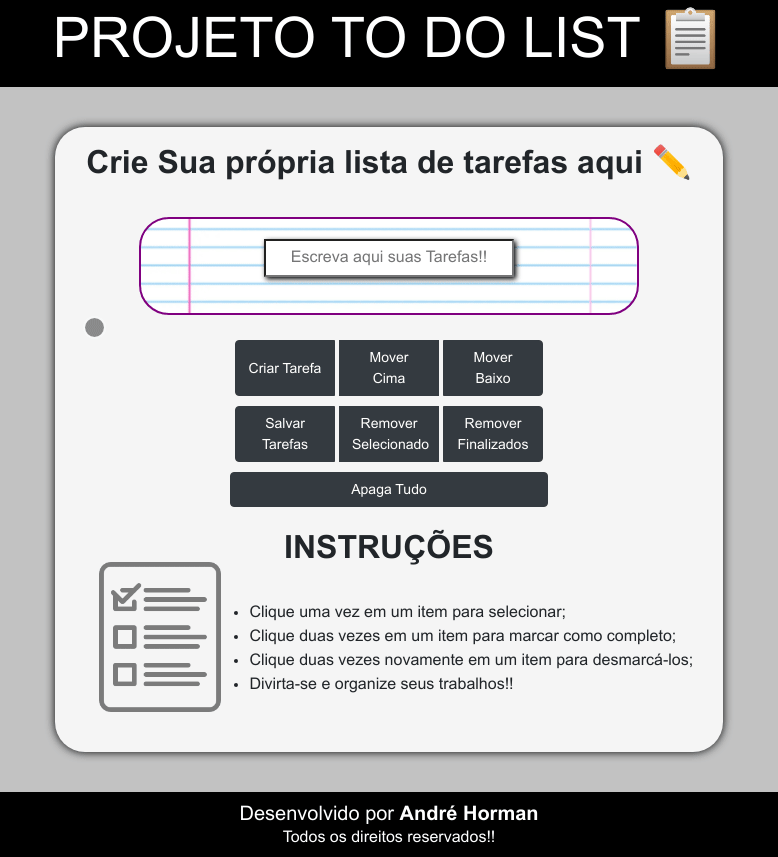

# PROJETO TO DO LIST 📋✏️

- O objetivo é criar uma lista de tarefas para o usuário permitindo adicionar, remover, editar e salvar suas tarefas

- Utilizamos HTML, CSS e JAVASCRIPT, praticando lógica de manipulação de elementos do DOM, manipulação de lista e uso do local storage para armazenar nossas tarefas
  

  

**[ABRIR PROJETO NO NAVEGADOR]()**

---

# TECNOLOGIAS UTILIZADAS 💻

- **HTML**
- **CSS**
- **BOOTSTRAP**
- **JAVASCRIPT**
    

---

# INSTRUÇÕES IMPORTANTES 📝

## COMO BAIXAR O PROJETO:

1. Clone o repositório:
   - **`git clone git@github.com:ANDREHORMAN1994/PROJECT-05-TO-DO-LIST.git`**
2. Entre na pasta do repositório que você acabou de clonar:
   - **`cd PROJECT-05-TO-DO-LIST`**
       

## COMO RODAR O PROJETO:

1. Baixe a Extensão Live Server:
   - Clique no ícone **`Extensions`** do Vs Code ou use o atalho **`CTRL + SHIFT + X`**
   - Digite no campo de busca **`Live Server`**
   - Instale a extensão
   - Abra o arquivo **`index.html`** \* Clique no botão **`“Go Live”`** no canto inferior do Vs Code ou Execute o comando **`ALT + L ALT + O`** para abrir com o Live Server.
       

---

# VQV 🚀
